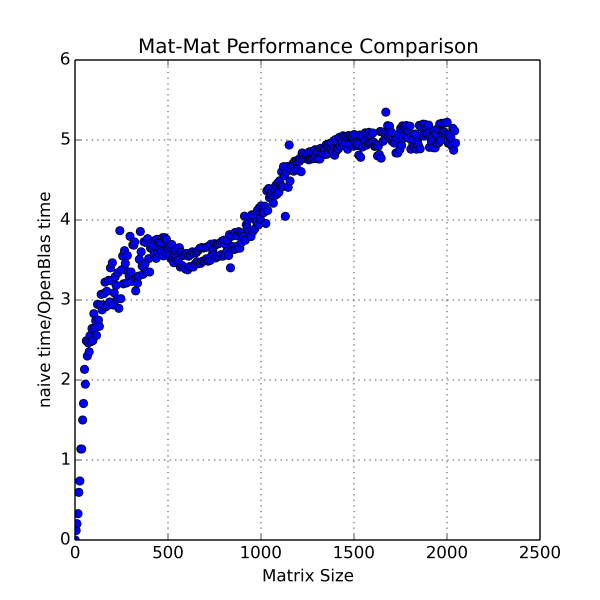
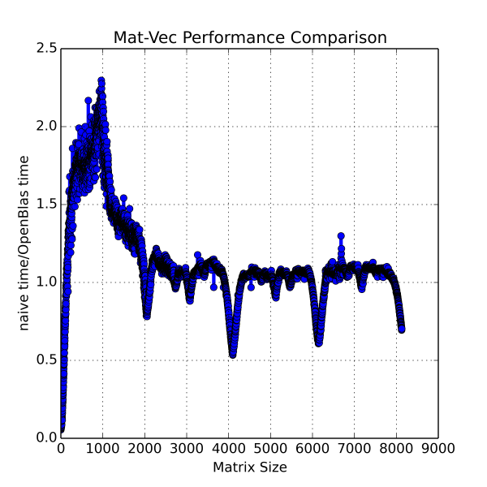

# Julia Performance Techniques

There are a number of idioms useful for writing high performance Julia, as well as a few syntactic conveniences that should be avoided.

## Array Referencing and Copying
Julia allows users to create references to arrays, which just creates an additional name for the same array (no data is copied, and changes to the array made using one name are reflected when using the other), copy an array, which copies the underlying data and creates a new, fully independent array, and deepcopy, which recursively copies the array and its contents.  For example

```
A = rand(3,3)
B = A  # B and A are different names for the same array

C = copy(A)  # C is a new array with values copied from A
D = deepcopy(A)  # D is a new array, with values copied from A
```

Now, it appears from this example that `copy` and `deepcopy` are the same.  This is true if the elements of the array are immutable.  While most Julia objects are passed by reference, immutable objects are copied.  This means that the array A stores the actual object, not a reference to it.  When the copy function is called, it copies the contents of the array, the immutable objects, to the new array.  When deepcopy is called, it copies the contents of the array and anything the contents of the array might point to.  To see the distinction:

```
A = Array(Array{Int,1}, 2)  # array of array with 2 elements
A[1] = [1,2,3]
A[2] = [4,5,6]

B = copy(A)  # copies the references in A, so the arrays [1,2,3] and [4,5,6] are still shared

B[1] = [7,8,9]  # now the first element of B is a reference to a different array, A[1] is unchanged 

C = deepcopy(A)  # copies A and the arrays within A 
```

## Column Major
Julia arrays are stored in column major format.  This is the same as Fortran and Matlab, but difference than C/C++.  This is important if you pass a 2D (or higher) array to C, the C code will see it as being transposed.

It is significantly faster to loop along the columns of a column major array than the rows, so all arrays should be created so that the dimension that will be iterated over the fastest is the first dimension.

## ArrayViews
Using slice notation (ie. the colon operator) on arrays is an inefficient operations that allocates a significant amount of memory.  
This can be avoided using the `ArrayViews` package.  
For example

```
using ArrayViews
A = rand(10, 10)
b = A[:, 1]
b_view = view[A, :, 1]
```

The vectors `b` and `b_view` are similar in that they allow access to the values in first column of `A`, but they do so in different ways
`b` is a copy of the first column of `A`, while `b_view` is a reference to it.  Changing an element of `b_view` changes the corresponding element in `A`.  Changing an element of `b` does not.
This can be beneficial for high performance code because copying the data takes time so it should be avoided whenever possible.  The elements of `b_view` can be accessed just like the elements of any array.  Note that views can be taken that are not contiguous in memory, for example taking a view of the first row of a matrix.  The `view` constructor can take an integer, a range, or a colon for any of the index values.  Also, composition of views is allow, so you can take a view of a view to get a subset of the array pointed to by the original view.


The copy and deepcopy behaviors are as follows:

```
b_copy = copy(b_view)  # b_copy is an array containing the elements pointed to by b_view

b_deepcopy = deepcopy(b_view) # copies entire underlying array (A) and creates a new ArrayView pointing to it
```

Note that a `copy` of an ArrayView produces an Array that is a copy of only the part A that the ArrayView allows access to, in this case the first column of A.  A `deepcopy` copies the ArrayView and the entire underling matrix (A in the example above) and create a new ArrayView referencing it.

### UnsafeView
The ArrayViews package has a second type corresponding to all the regular `view` types, called an `unsafe_view`.  `unsafe_view`s use a different method to store the the connection to the original array (a raw pointer rather than a Julia reference), which is potentially smaller in memory and slightly faster to access.  The limitation is that the `unsafe_view`s only work correctly on arrays whose elements are `isbits` types.  For this reason, use of `unsafe_view`s are not recommended in ODL codes.

## SubArrays
Another method of getting a view of an array is SubArrays.  SubArrays are constructed similarly to ArrayViews:

```
A = rand(3,3)
a_sub = sub(A, :, 1)  # get first column of A
```

Modifying elements of `a_sub` modify the corresponding elements in `A`.  Like ArrayViews, it is permissible to use ranges, the colon operator, or integer values for any of the indices.  Taking non-contiguous views is allows, with the same performance penalty as accessing the original array non-contiguously.

### SubArrays vs. ArrayViews
So, whats the difference between SubArrays and ArrayViews? SubArrays are somewhat more expensive to construct than ArrayViews, both in terms of time and memory.  When used inside a loop, it is preferable to use an ArrayView.  Both ArrayViews and SubArrays can be passed to C code.

## Matrix Vector and Matrix Matrix Multiplication
Efficiently multiplying vectors and matrices is a non-trivial task.  Julia provides this capability through OpenBlas, a high performance BLAS implementation.  The Julia multiplication operator, when applied to a matrix and a vector or a matrix and another matrix, dispatches to the proper BLAS routines.  For large matrices, the OpenBlas implementation  is very efficient, but for small ones it is not.  This difference can be important for some application, including finite element and finite difference codes that do a lot of small matrix operations.  

By default, OpenBlas is multi-threaded, so it will use all CPU cores on a shared memory machine.  For high performance computing, there is typically one Julia process running on every CPU core, so we want the OpenBlas library called by each Julia process to use one thread.  To do this,  set the environmental variable `OPENBLAS_NUM_THREADS` to `1` before launching Julia. The matrix vector and matrix matrix multiplication routines in the package `PDESolverCommon` were bench-marked against the OpenBlas equivalents (with bounds checking disabled).  The results are shown in the figures.  For matrix-vector multiplication, the `PDESolverCommon` implementation is faster for square matrices of size 128 or less, and is approximately the same for matrices of size 2000 or larger.  For matrix-matrix multiplication, the `PDESolverCommon` implementation is faster for square matrices of size 28 or less.  For very small matrices, the OpenBlas routines are slower by a factor of 5 or more, indicating it is very advantageous to use the `PDESolverCommon` ones when doing small matrix math.




## Filling Arrays
The `fill!(arr, val)` efficiently fills the array with the specified value.  This is the preferred method of, for example, zeroing out an array.

## Using b[:]
`b[:]` makes a copy of the array.  Using ArrayViews or SubArrays wherever possible.

## Concrete Types with Concrete Fields
Julia's type inference system compiles a version of a function for each unique set of argument types.  So if we define a function: <br />

```
function addNums(a, b) 
  return a + b 
end
```

If we call this function with two Float64 values and then two Int64 values, the function will be compiled twice, each the first version for floating point number and the second for integers.  Because the types of all arguments are known (just like in C), the the compiled functions will be just as fast as C functions.

A problem happens if we have something like this: 

```
type type1  
  a::Number  
end  

function addFields(obj1, obj2) 
  return obj1.a + obj2.a) 
end 

obj1 = type1(1) 
obj2 = type1(1) 
addFields(obj1, obj2) 
```

When addFields is compiled, it will be specialized on the type `type1`.  It will compile a version of the function that works for **any**  object of type `type1`.  Because `type1` as a field that is of type `Number`, it could be a Float64, a Float32, an Int64, and Int32, etc.  The compiler has to compile a generic version of the function because it does not know what the types of `obj1.a` and `obj2.a` will be.  This will be slow.  To remedy this, whenever good performance is required, types should have concrete types as fields, rather than abstract types.  

If you want to define a type that can have fields of different types, you can parameterize a type as follows:

```
type type1{T} 
  a::T 
end 
``` 

Using this definition of `type1`, `addFields` will be compiled for each value of T of each argument.  Because field `a` is of type T, the compiler knows its type, and can generate a very fast version of the function.

## Function with Abstract Arguments
As shown above, specifying the types of arguments to a function is optional in Julia.  If no type is specified, then there are no restrictions on the types that can be passed to the function.  If an abstract type is specified, then only types which are subtypes of the specified abstract type are allowed. If a concrete type is specified, only that type is allowed  For example:

```
function addNums(a::Number, b::Number) 
  return a + b 
end 
```

This function can take two argument, which must both be subtypes of `Number`, and returns their sum.  Although optional, the type specifications can serve as a kind of documentation about what the function is capable of doing.  Adding two strings is not a valid operation (Julia uses the `*` operator for string concatenation ), so this function will not accept strings as arguments.

Another use of type annotations is to distinguish different methods of a function.  For example, if you wanted to define two versions of a function, one that handles integers and another that handles floating point values, this could be done as follows: 

``` 
function compare(a::Integer, b::Integer) 
  return a < b 
end 

function compare(a::FloatingPoint, B::FloatingPoint)
  return (a - b) < 1e-14 
end 
```

If there is ambiguity in what function to call, Julia prints a warning and picks one at random.


### Specifying Static Parameters
If a function accepts a type that has static type parameters, you (the programmer) have the option of fully specifying, partially specifying, not specifying, or omitting what values the static parameters must be.
If a static parameter is not specified, then there is no restriction on its value.  For example the type:

```
type mytype{T1, T2}
  a::T1
  b::T2
end
```

and the function:

```
function addVals1(arg1::mytype{Float64, Int64})
  return arg1.a + arg1.b
end
```

Here the function can only take an object of type `mytype` with a first static parameter as `Float64` and a second static parameters as `Int64`.
Here the static parameters are fully specified.
Now look at the function:


```
function addVals2{Ta, Tb}(arg1::mytype{Ta, Tb})
  return arg1.a + arg1.b
end
```

Here the static parameters `Ta` and `Tb` (corresponding to `T1` and `T2`), are left unspecified.
Note that they appear following the function name in curly braces and in the type annotation of `arg1`.  This is a syntactic requirement of Julia.
No restrictions are placed on the values of the static parameters.  Note that `Ta` and `Tb` are now variables within the function, and 
can be used, for example, when creating an array to specify the element type.

For an example of partially specifying the static parameters, examine the function:

```
function addVals3{Tb}(arg1::mytype{Float64, Tb})
  return arg1.a + arg1.b
end
```

Here the first static parameter of `arg1` must be a `Float64` but the second static parameter is not restricted.

The static parameters can be omitted entirely like this:

```
function addVals4(arg1::mytype)
  return arg1.a + arg1.b
end
```

This places no restrictions on the values of the static parameters.  It is equivalent to `addVals2`, except that
`Ta` and `Tb` are not introduced as variables in the function.  Note that the compiler still knows that 
`arg1` has 2 static parameters and specializes the code accordingly.  Omitting the static parameters is simply a syntactic shortcut
for the programmer is `Ta` and `Tb` are not needed as variables inside the function.

An interesting variation on omitting type parameters is this:

```
function addVals5{Ta}(arg1::mytype{Ta})
  return arg1.a + arg1.b
end
```

Here `Ta` is the value of the first static parameter of `arg1`, and the second parameter is not restricted.
Note that all static parameters up to and including the one specified must be introduced as variables in the function (as in `addVals2`).
For example, if a type has 5 static parameters and you only want to specify the 3rd, you must list the first 3, and omit the final 2.  There is (currently)
no way to omit the first 2.

## Invariant Type System
One slight caveat to using abstract type annotations is that fact that Julia has an invariant type system.  One consequence is that Array{Int64, 1} is not a subtype of Array{Integer,1}, even though Int64 is a subtype of Integer.  To get around that in a function definition we can do the following:

```
function addArr{T <: Integer}(a::Array{T, 1}, b::Array{T,1})
  return a + b
end
``` 

This function definition says that it takes two arrays of with elements of the same type, and that type must be a subtype of integer.  This is slightly more restrictive that we might want, so we can also write: 

```
function addArr{T <: Integer, T2 <: Integer}(a::Array{T, 1}, b::Array{T2,1})
  return a + b
end
``` 

Which says that the function takes arrays of two different types, `T` and `T2`, both of which must be subtypes of Integer, but they do not have to be the same.

Note that we could have written the earlier definition of `addNum` like this:

```
function addNums{T, T2}(a::T, b::T2)
  return a + b
end
```

The only difference is that now T, T2, the types of the arguments, are now variables inside the function.  In Julia, datatypes (and function names too) are just variables, of abstract types `DataType` and `Function`, respectively, and can be used just as if we had written the literal name.  For example, if we want to create a variable of type Float32:

```
a = Float32(2.5)
T = Float32
b = T(2.5)  # equal to a
```

## Types with Associated Methods
One of the standard programming paradigms that works very well in Julia is creating types and methods that take the type as an argument.  The type stores data, and the functions use that data to perform actions.  Note that the functions are not part of the type (ie. this is different than a C++ class), but take the type as an argument (usually their first argument), and any other data needed to perform the operation.  A file that contains a type definition will usually also contain the basic functions needed to operate on that type.

## Callable Types
A more recently added feature is the ability to overload the call operator.  This allows callable types.  If you have a type names `type1`, you can define the `function call(a::type1, b, c)`.  The first argument to the `call` function must be the type, all others are regular arguments.  If you have an object of type `type1` named `obj1`, you can now call it as `obj1(b, c)`.  

This solves a performance problem with passing functions as arguments to other functions.  For purposes of this discussion, functions are of abstract type Function, and do not have a concrete type. This means that a function that takes another function as an argument cannot specialize on what function is passed to it, a generic version is compiled that can take any function.  This means the function call is both dynamically dispatched, which is a little bit slow, and cannot be inlined.  If the function is called inside a loop, not inlining it is very bad for performance.  Callable functions (referred to as Functors in this context), can solve this problem.  For every function you want to pass, create a dummy type, and define the call function for that type, and pass a dummy object as an argument.  Because you created a new type, the receiving function is recompiled and therefore specialized based on the type, so it can inline the call to the function.

An example:

```
type dummytype 
end

function call(a::dummytype, args...)
  do calculation here 
end 

function myfunc(a, b)
  a(args...)
end

# here is the call sequence 
obj = dummytype()  # construct dummy obj 
myfunc(obj, 3.0)  # pass obj to myfunc, which call the call function
```

`myfunc` gets recompiled for every different type passed to it, so it can inline the call to obj(args...), thus solving the performance problem.
