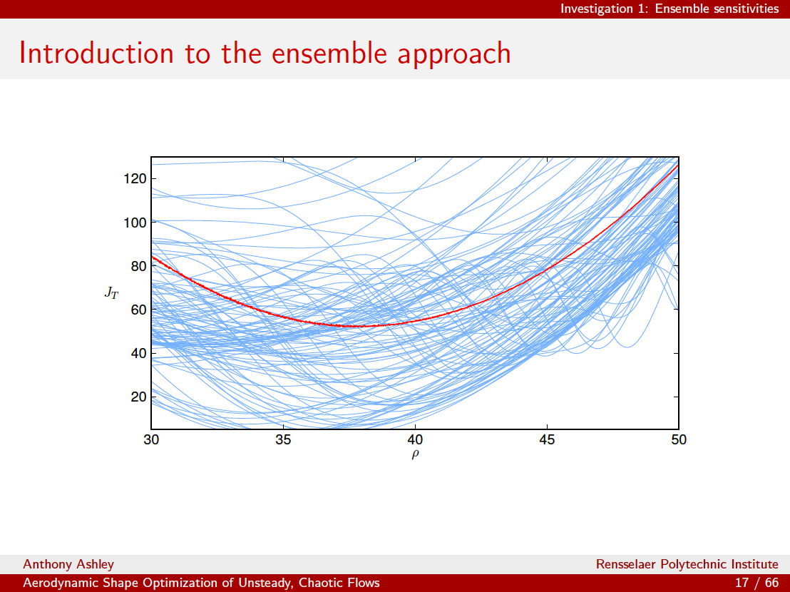

# Using beamer
Beamer is a latex utility for making nice pdf presentations. Here's the basics of how to use it:

Put at the top:
```
\documentclass{beamer}
```
After that, put your latex preamble like you're making a normal latex document, then setup your Beamer theme.
```
\usetheme{Berlin}
\usecolortheme{beaver}
\beamertemplatenavigationsymbolsempty
```
The third line gets rid of some ugly navigation buttons.

Then make your title and start the document:
```
\title{A presentation title}
\author[An author]{An author}
\institute{Rensselaer Polytechnic Institute}
\date{A date}
\titlegraphic{\includegraphics[width=\textwidth]{img/logo_both4.png}}

\begin{document}
```

Now, set up each slide. In Beamer, a slide is called a frame.
Title slide:
```
\begin{frame}
\titlepage
\end{frame}
```
Here's a couple example slides:
```
\begin{frame}{Here's a graphics slide}
  \begin{figure}
    \begin{center}
      \includegraphics[width=0.9\textwidth]{some_image.pdf}
    \end{center}
  \end{figure}
\end{frame}

\begin{frame}{Here's a math slide}
  Some equations:
  \begin{align*}
    \Javg(\rho)
    & = \frac{1}{N} \sum_{i=1}^{N} \J_{i,\tau}\left( s, u_{i}(s)\right), \\
    & = \frac{1}{N}\sum_{i=1}^{N} \frac{1}{2 \tau} \int_{0}^{\tau}
    \left( z_{i}(t,\rho) - z_{\text{targ}}\right)^{2} \, dt
  \end{align*}
  An itemized list:
  \begin{itemize}
    \item Item 1
    \item Item 2
    \item Item 3
  \end{itemize}
\end{frame}
```

After all the slides, you end the document like normal:
```
\end{document}
```


# Headers & footers
Here's how to customize headers & footers in beamer nicely. 

The way to think about it is that these `author in head/foot` or `title in head/foot` are types of 
Beamer elements, and control the color. 
So you set up `beamercolorbox`'s with appropriate length, pass in `author in head/foot` or 
whatever to set the color scheme, then put the text in that box.

Here's my footer (ignore the raw/endraw stuff, that's just a workaround to stop a markdown error for this wiki):

```
\makeatletter
\setbeamertemplate{footline}{
  \leavevmode%
  \hbox{%
    \begin{beamercolorbox}[wd=.5\paperwidth,ht=2.25ex,dp=1ex,left]{author in head/foot}%
      \hspace*{4ex}\usebeamerfont{author in head/foot}\insertshortauthor
    \end{beamercolorbox}%
    \begin{beamercolorbox}[wd=.5\paperwidth,ht=2.25ex,dp=1ex,right]{author in head/foot}%
      \usebeamerfont{author in head/foot}\insertshortinstitute\hspace*{2ex}
    \end{beamercolorbox}}%
  \newline
  \hbox{%
  \begin{beamercolorbox}[wd=.8\paperwidth,ht=2.25ex,dp=1ex,left]{title in head/foot}%
    \hspace*{4ex}\usebeamerfont{title in head/foot}\insertshorttitle
  \end{beamercolorbox}%
  \begin{beamercolorbox}[wd=.2\paperwidth,ht=2.25ex,dp=1ex,right]{title in head/foot}%
    \usebeamerfont{title in head/foot}\insertframenumber{} / \inserttotalframenumber\hspace*{2ex}
  \end{beamercolorbox}}%
  \vskip0pt%
}
\makeatother
```

And here's how I set up a particular section's header:

```
\makeatletter
\setbeamertemplate{headline}{
  \leavevmode%
  \hbox{%
  \begin{beamercolorbox}[wd=\paperwidth,ht=2.25ex,dp=1ex,right]{title in head/foot}%
    \usebeamerfont{title in head/foot}Investigation 1: Ensemble sensitivities\hspace*{2ex}
  \end{beamercolorbox}}%
  \vskip0pt%
}
\makeatother
```


Here's what it looks like:



# Backup slides
Also helpful is setting up a backup slide section with
```
\newcommand{\backupbegin}{
   \newcounter{finalframe}
   \setcounter{finalframe}{\value{framenumber}}
}
\newcommand{\backupend}{
   \setcounter{framenumber}{\value{finalframe}}
}
```
Then your backup slides won't be included in the final # of slides count if you have them grouped like this:
```
\backupbegin

\begin{frame}{something}
something
\end{frame}

\backupend
```
